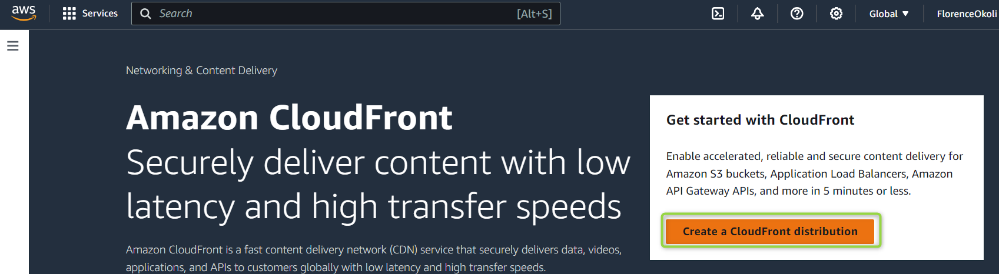

# Hosting a static website on an S3 bucket using Amazon CloudFront

## Overview 
Create a static website on Amazon S3 bucket(private bucket) but with public read policy assigned, using cloud front for Content Delivery Network. 

## Introduction

* Static Website

A static website is a lightweight, fast-loading, and easy-to-maintain type of website that presents fixed content to users using basic web technologies. A static website consists of only client-side technologies such as HTML, CSS, and JavaScript. It doesn't require a server to generate or serve content dynamically.

* Amazon S3

An Amazon S3 (Simple Storage Service) bucket is a fundamental component of Amazon Web Services (AWS) that provides scalable object storage in the cloud. An Amazon S3 (Simple Storage Service) bucket serves as a fundamental storage container within the S3 service. 

* Amazon CloudFront 

Amazon CloudFront is a content delivery network (CDN) service provided by Amazon Web Services (AWS). Its primary function is to deliver content, such as web pages, videos, images, and other static or dynamic assets, to users with low latency and high transfer speeds.

 Integrating Amazon S3 for storage of static website contents and Amazon CloudFront for content delivery and caching, provides you with a scalable and performant hosting solution on AWS cloud.

## Prerequisite

- An AWS account
- Files or folders for your static website. I used this template [here](https://startbootstrap.com/theme/agency)

## Follow the steps below to host a static website on an S3 bucket using CloudFront.

1. Create an Amazon S3 bucket

* Log in on your AWS management console and search for the S3 service. Proceed to create a bucket as seen below:


* Select the general purpose type for your bucket and a unique name for your bucket. 
If the name is not unique, you won't be able to create a bucket.


* Leave every other settings on default. Scroll down and click on create bucket


* Once the bucket has been successfully created, click on _view details_ or your bucket name to view the details of the bucket created.


2. Upload files into the S3 bucket

* In the bucket overview page, under the objects tab, click on upload to upload the file/folders of your website.


* Drag and drop your files or add them as files/folders.
 

* Scroll to the end of the page and click on upload.

 


* Once the upload has been succesful as seen in the image below, close the page.


3. Create a CloudFront Distribution to make your AWS S3 bucket private

* On the AWS management console, search for Cloudfront and click on it. Then proceed to create a CloudFront distribution.




- Next, enter an origin name. It should be the same with the name you have as your bucket.
Proceed to create a new Origin Access Control.
See the image below:


- Set your WAF to **Do not enable security protection** since this is for practice. 


- Leave every other settings on default and proceed to create your distribution


- To complete the distribution configuration, copy policy and click on __Go to S3 permissions to update policy__


- On the permissions tab under your bucket, scroll to bucket policy and click edit. Delete the policy you pasted before which you used to see if your bucket was publicy accessible before we used cloudfront to make it private. Then paste the policy. Here is what it should look like
```
{
        "Version": "2008-10-17",
        "Id": "PolicyForCloudFrontPrivateContent",
        "Statement": [
            {
                "Sid": "AllowCloudFrontServicePrincipal",
                "Effect": "Allow",
                "Principal": {
                    "Service": "cloudfront.amazonaws.com"
                },
                "Action": "s3:GetObject",
                "Resource": "arn:aws:s3:::florence-okoli/*",
                "Condition": {
                    "StringEquals": {
                      "AWS:SourceArn": "arn:aws:cloudfront::xxxxxxxxxxxx:distribution/E1FC6K30Z0Z15Y"
                    }
                }
            }
        ]
      }
```


- Save changes and proceed to  to your CloudFront page and copy your Distribution domain name. Paste it on your browser and add /index.html to it. Make sure to use your own Distribution domain name.


- Finally, the outcome of your page should look like this


## Conclusion

In conclusion, hosting a static website on an Amazon S3 bucket with Amazon CloudFront combines the durability of S3 storage with the global reach and performance optimization of CloudFront's content delivery network (CDN).

 By configuring CloudFront with an Origin Access Identity (OAI), you can keep your S3 bucket private while still benefiting from fast and secure content delivery. 
 
 This guide offers a scalable and cost-effective solution for serving static web content globally. Leveraging AWS services like S3 and CloudFront showcases the powerful capabilities of cloud infrastructure in simplifying website deployment and ensuring a seamless user experience.
